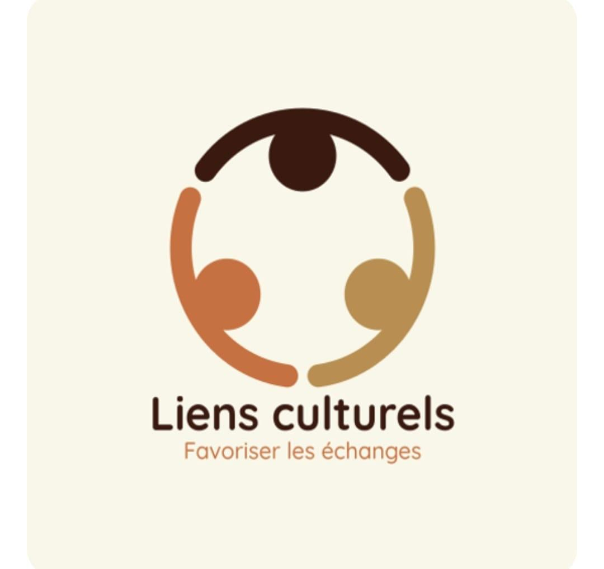

# site-liensculturels
# Site Web de l'Association Liens Culturels



Bienvenue sur le dépôt GitHub du site officiel de l'association **Liens Culturels**. Ce projet a pour but de fournir une vitrine numérique moderne, accessible et informative pour présenter les missions, les projets et les activités de l'association.

## 🎯 Objectif du Site

Le site `www.liensculturels.org` a été conçu pour :
* **Informer** le public sur la vision et les actions de l'association.
* **Faciliter l'interaction** avec la communauté via des formulaires de contact et d'adhésion.
* **Promouvoir les projets**, notamment le programme de bourse scolaire "Avenir Partagé".
* **Centraliser la communication** grâce à une newsletter et une médiathèque.

---

## ✨ Fonctionnalités Principales

* **Présentation Complète :** Pages dédiées à l'association, au bureau et aux dirigeants.
* **Galerie Média :** Une photothèque interactive et une vidéothèque pour partager les moments forts.
* **Formulaires Dynamiques :**
    * Un formulaire de **contact** pour les demandes d'information.
    * Un formulaire d'**adhésion** pour les nouveaux membres.
    * Les soumissions sont traitées par une architecture "serverless" et envoyées par e-mail.
* **Newsletter :** Un formulaire d'inscription intégré au service Brevo pour garder la communauté engagée.
* **Design Responsive :** Le site est entièrement adaptable aux ordinateurs, tablettes et mobiles.

---

## 🛠️ Technologies Utilisées

Ce site repose sur une architecture moderne, performante et économique, combinant des technologies statiques pour l'interface et des services "serverless" pour l'interactivité.

* **Frontend :**
    * **HTML5**
    * **CSS3** (avec Flexbox et Grid pour la mise en page)
    * **JavaScript "vanilla"** (sans framework) pour la gestion des formulaires et des interactions.
    * **Font Awesome** pour les icônes.
    * **Lightbox2** pour la galerie photo.

* **Backend (Serverless) :**
    * **AWS API Gateway :** Pour créer un point d'entrée sécurisé pour les données des formulaires.
    * **AWS Lambda :** Pour exécuter le code de traitement des formulaires (écrit en **Python 3.11**).
    * **AWS SES (Simple Email Service) :** Pour l'envoi fiable des e-mails de notification.

* **Services Tiers :**
    * **Brevo (Sendinblue) :** Pour la gestion professionnelle de la newsletter.

---

## 🚀 Installation et Déploiement

Le site est hébergé en production sur **AWS S3 + CloudFront** (voir infra ci-dessous).

1.  Clonez ce dépôt :
    ```bash
    git clone https://github.com/magonnoude/site-liensculturels.git
    ```
2.  Ouvrez le fichier `index.html` dans votre navigateur (ou `python3 -m http.server`
    depuis la racine) pour visualiser le site en local.

**Déploiement (voie normale) :** tout push sur `main` déclenche
`.github/workflows/deploy.yml` — sync S3 + invalidation CloudFront automatiques.

**Déploiement manuel :**
```bash
cd ~/RMS_Projects/www.liensculturels.org
./deploy.sh "message de commit"
```

Les endpoints des formulaires dans `assets/js/main.js` et les liens de la newsletter sont
configurés pour la production et ne nécessitent pas de modification sauf en cas de
changement d'infrastructure.

---

## ☁️ Infrastructure AWS (compte `928883700132`, région `eu-west-3`)

| Ressource | Valeur |
|---|---|
| S3 (site statique) | `www.liensculturels.org` (eu-west-3) — privé, accès via CloudFront OAC uniquement |
| CloudFront | `E27Z3FWSMEYT5U` → `d3egnxbq47opx9.cloudfront.net` |
| Alias CloudFront | `www.liensculturels.org`, `*.liensculturels.org` |
| CloudFront Function | `redirect-root-to-www` (301 `liensculturels.org` → `www.liensculturels.org`) |
| Certificat ACM | `*.liensculturels.org` (us-east-1, wildcard sous-domaines uniquement — **pas** de SAN pour le domaine nu) |
| DNS | Géré chez **Gandi** (hors Route53 — ce compte AWS n'a pas de zone hébergée pour ce domaine) |
| API Gateway | `liensCulturels-API` (HTTP API, id `8igk1o6vw4`) — routes `POST /contact`, `POST /adhesion` |
| Lambda contact | `liensCulturels-contact-form` (Python 3.11) |
| Lambda adhésion | `liensCulturels-adhesion-form` (Python 3.11) — **déjà en production**, malgré la mention historique "endpoint à créer" dans `assets/js/main.js` |
| Newsletter | Formulaire Brevo (Sendinblue) intégré dans `footer` de chaque page |

⚠️ **Bug connu (priorité 1 — voir `ROADMAP.md`) :** le domaine nu `liensculturels.org`
(sans `www`) échoue en HTTPS (handshake TLS refusé, le domaine n'est ni dans les SAN du
certificat ACM ni dans les alias CloudFront) et renvoie une 403 CloudFront en HTTP. La
fonction `redirect-root-to-www` existe déjà côté CloudFront mais n'est jamais atteinte tant
que ce point n'est pas corrigé.

Le backend serverless (Lambda, API Gateway, SES) n'est pas versionné dans ce dépôt.

---

## 📂 Structure des Fichiers

```
.
├── .github/workflows/deploy.yml  # Déploiement auto (push main → S3 + CloudFront)
├── assets/
│   ├── css/
│   │   └── style.css       # Feuille de style principale
│   ├── img/                # Toutes les images (logos, photos, etc.)
│   └── js/
│       ├── main.js         # Formulaires contact/adhésion + vidéothèque
│       ├── loader.js        # Chargeur de composants (non utilisé actuellement, voir ROADMAP)
│       └── agenda-script.js
├── documents/               # PDFs publics (statuts, règlement intérieur, PV d'AG)
├── tasks/                   # todo.md / lessons.md — suivi de travail Claude Code
├── index.html               # Page d'accueil
├── a-propos.html
├── bureau.html
├── contact.html
├── ... (toutes les autres pages HTML)
├── sitemap.xml / robots.txt # SEO
├── deploy.sh                 # Déploiement manuel (miroir du workflow GitHub Actions)
├── CLAUDE.md                 # Règles de travail pour Claude Code sur ce dépôt
├── ROADMAP.md                 # Backlog priorisé d'améliorations
└── README.md                 # Ce fichier
```

---

## Contact

Pour toute question relative à l'association, veuillez utiliser le formulaire de contact du site ou envoyer un e-mail à **contact@liensculturels.org**.